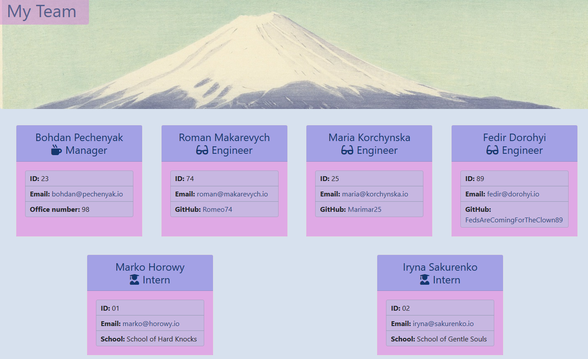

# KarmaTeeming-ManaJeering

A node.js app using CLI to help managers with managing their team members by saving and dynamcically generating an HTML file with their basic contact and other relevant information. 

## Features

* For managers' use only - all other roles are forbidden from proceeding. The app is started by running the main ***app.js*** file. 

* An ***Inquirer npm package*** is used to prompt the user to enter their own information first, as the manager of the team, and then each subsequent team member's information, beginning with their role on the team, followed by name, id, email, and special characteristic that differs for each employee class.

* Employees are represented by a class with several subclasses extending it - Manager, Engineer, or Intern. (***JS files*** in the ***lib/*** directory)

* Templates exist for each employee class, as well as for the overall team page that will be generated. Distinct CSS stylings have been applied to make the UI stand out uniquely. (***HTML files*** in the ***templates/*** directory and the ***CSS file*** in ***assets/*** directory) 

* Once all the information is input, an ***HTML renderer*** file (***JS file*** in the ***lib/*** directory) is called upon to render the HTML page for the team. The functionality is such that the "main" template is taken and the individual employees' templates are generated and inserted into the main template, sorted by employee class (manager first, then engineers, then interns). The file is saved to the ***output/*** directory. 

* After this, the manager can easily look up the information by revisiting this file. 

## Possible extensions

* Additional functionality could provide a way to update the file without having to overwrite it fully - adding or removing individual team members and their information. 

## Links

[Finished app repository](https://github.com/BohdiCave/KarmaTeeming-ManaJeering/)

[Video demo of the app in action](https://www.awesomescreenshot.com/video/1615787?key=125adf4b48b2df16dbf1dc3a64658a60)

## Screenshot

